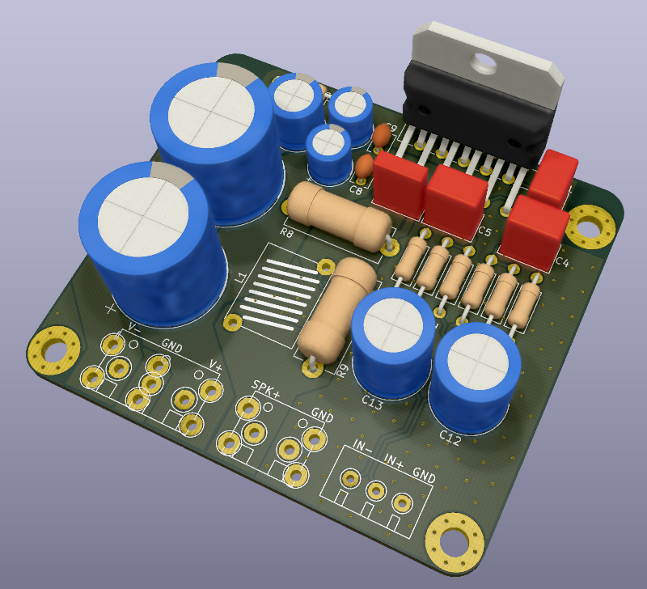
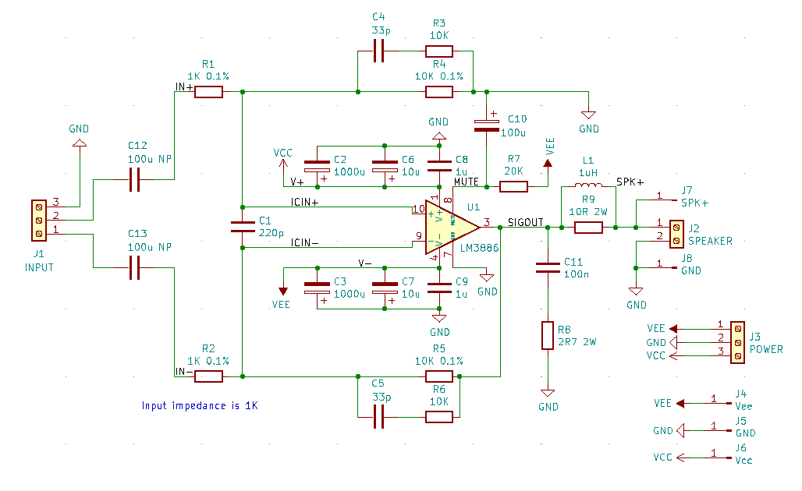
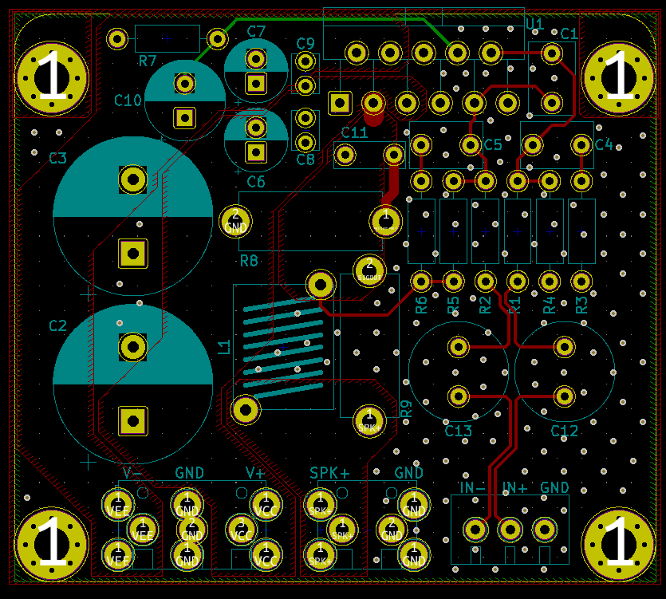

# LM3886 IC amplifier with balanced inputs using THT and SMD components
Schematics and PCB layout for balanced inputs LM3886 amplifier. Created using KiCad v5.

Resources used to design this amp:
* Official datasheet - [https://www.ti.com/lit/ds/symlink/lm3886.pdf](https://www.ti.com/lit/ds/symlink/lm3886.pdf)
* Neurochrome website articles - [https://neurochrome.com/pages/taming-the-lm3886-chip-amplifier](https://neurochrome.com/pages/taming-the-lm3886-chip-amplifier)

## PCB rendered in 3d:

# Schematics notes:

This is balanced (or differential) implementation of the amplifier. Meaning, you will need to supply IN+ and IN- in addition to the GND for the input signal.
LM3886 acts as a difference amplifier providing CMRR performance from the datasheet and limited by the precision of the feedback resistors - 0.1% resistors will give max theoretical CMRR of 66dB.
Inputs are DC coupled with 100u capacitors and form HP filter with R1||R2=1K giving fc=1.59Hz.
Power supply decoupling capacitors are sized according to the Neurochrome article. 

Because input resistance is 1K you will need to provide some sort of impedance matching to be able to interface from other devices.

Optional so called "stability components" are included to provide for a nice clipping performance and will allow for more output power. Value of the capacitor in the feedback loop was reduced to 33p to adjust for a lower than datasheet gain. It can be reduced further to 27p safely.

The overall gain is configured to be 10V/V or 20dB. This is a minimum gain recommended by the datasheet and allows designer greater flexibility in choosing the previous stage.

Recommended power supply is dual 28V supply supplying 7A for one channel.

Schematics is below:

# PCB notes:

All elements are THT type.

